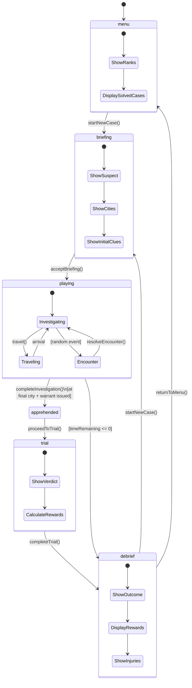
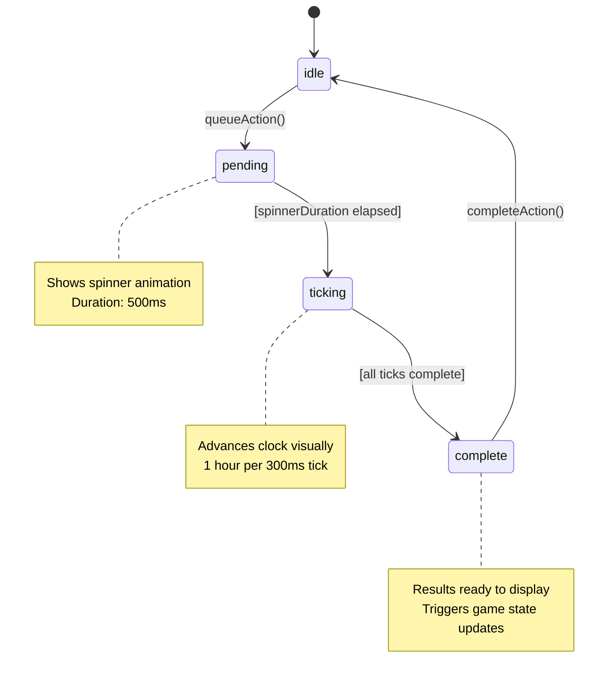
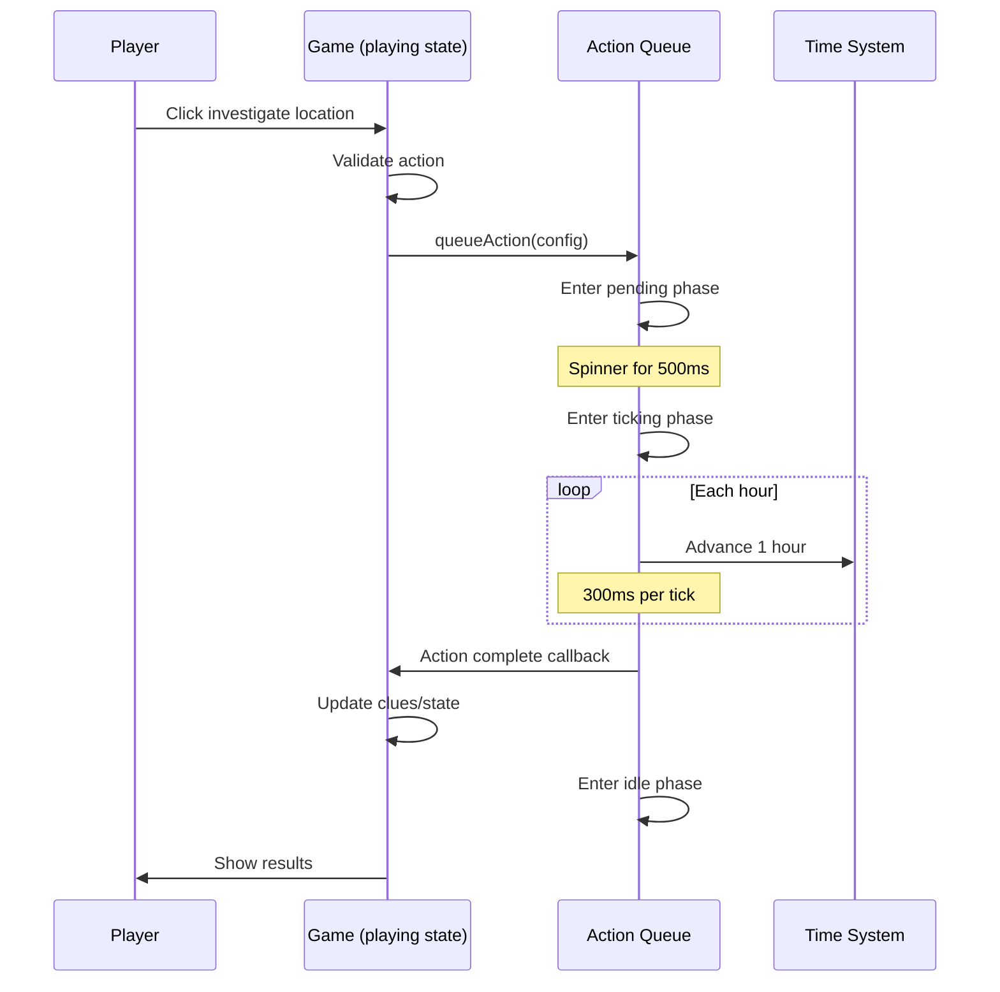
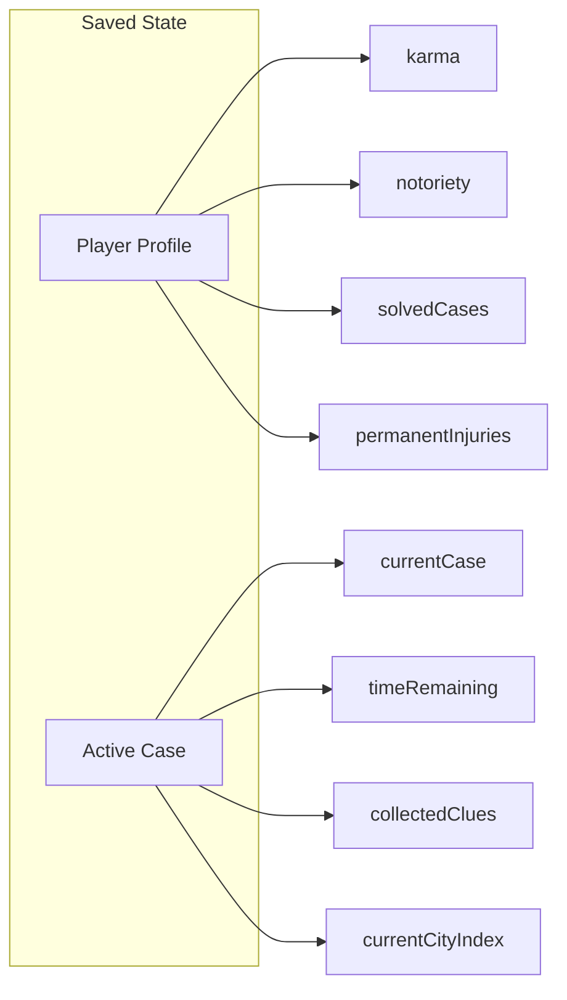

# Game State Machine

This document describes the state machines used in the Carmen San Diego game.

## Main Game State Machine

The primary game flow is managed by a single `gameState` variable in `useGameState.js`.

## Game States

| State | Description | Entry Trigger | Exit Triggers |
|-------|-------------|---------------|---------------|
| `menu` | Main menu showing player ranks and solved cases | Game start, `returnToMenu()` | `startNewCase()` |
| `briefing` | Case briefing with suspect info and initial clues | `startNewCase()` | `acceptBriefing()` |
| `playing` | Active gameplay - investigate, travel, encounters | `acceptBriefing()` | Time expires, arrest at final city |
| `apprehended` | Suspect cornered at final destination | Investigation at final city with warrant | `proceedToTrial()` |
| `trial` | Court trial to determine verdict | `proceedToTrial()` | `completeTrial()` |
| `debrief` | Case results and reward distribution | `completeTrial()` or time expired | `returnToMenu()`, `startNewCase()` |

## Action Queue State Machine

The action queue manages timed actions (investigations, travel, rogue actions) with visual feedback phases.

## Action Queue Phases

| Phase | Duration | Visual Feedback | Purpose |
|-------|----------|-----------------|---------|
| `idle` | - | None | Ready to accept new actions |
| `pending` | 500ms | Spinner | Build anticipation |
| `ticking` | 300ms per hour | Clock animation | Show time passing |
| `complete` | Immediate | Result display | Reveal outcomes |

## Integration: Playing State with Action Queue

## Key State Variables During Gameplay

The `playing` state maintains numerous sub-state variables:

### Case Progression
- `currentCase` - Active criminal case
- `currentCityIndex` - Position in 3-city chain (0, 1, 2)
- `isFinalCity` - Derived: true when at city index 2
- `wrongCity` - Player traveled to incorrect destination

### Time Management
- `timeRemaining` - Hours left (starts at 72)
- `currentHour` - Time of day (0-23)
- Auto-sleep triggers at 11pm (hour 23)

### Investigation State
- `isInvestigating` - Animation in progress
- `pendingInvestigation` - Queued but not revealed
- `collectedClues` - All clues found
- `investigatedLocations` - Locations checked in current city
- `lastFoundClue` - Most recent clue for display

### Encounters
- `currentGoodDeed` - Active good deed event
- `currentEncounter` - Henchman/assassination event
- `hadEncounterInCity` - Prevents duplicate encounters

## State Persistence

Game state is persisted to localStorage via `saveManager.js`:

Auto-save triggers:
- Briefing acceptance
- Clue collection
- Travel completion
- Case resolution

## Source Files

- **Main State Machine**: `src/hooks/useGameState.js`
- **Action Queue**: `src/hooks/useActionQueue.js`
- **Game Component**: `src/components/Game.jsx`
- **Save Manager**: `src/utils/saveManager.js`
