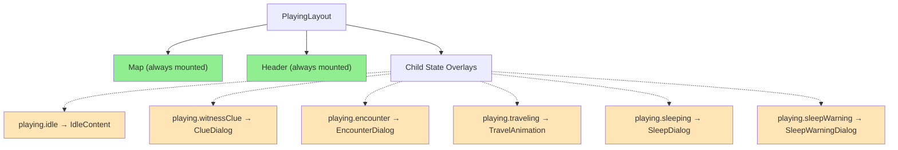
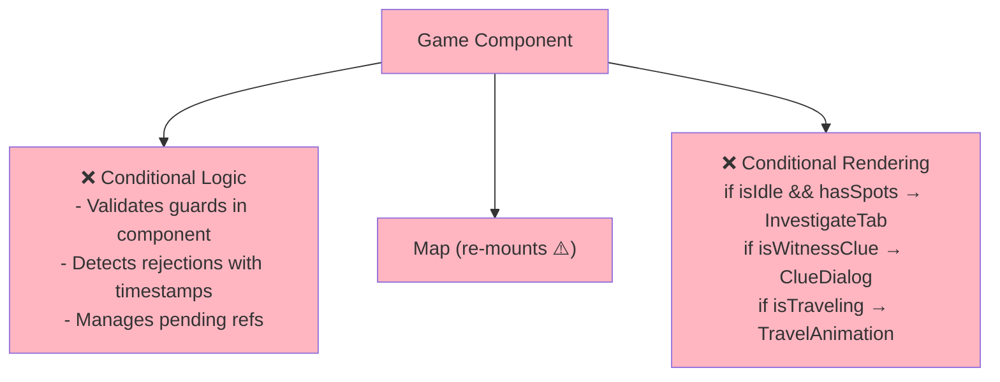
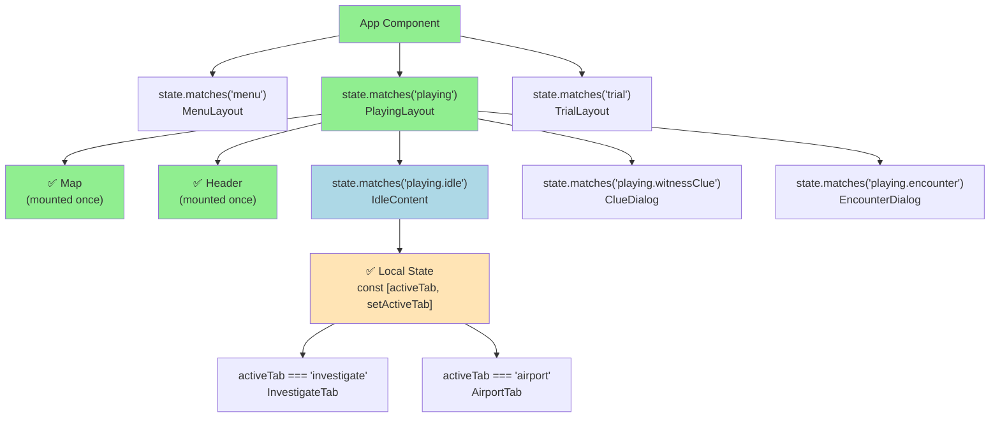

# Game State Machine

## Current States

The comment in code claims these states exist:

```
menu, briefing, playing, sleeping, warrant, trial, debrief, won, lost
```

But actually implemented:

```
menu, briefing, playing, apprehended, trial, debrief
```

**Not actually used:** `sleeping`, `warrant`, `won`, `lost`

---

## Current Transitions (as implemented)

```
┌──────────────────────────────────────────────────────────────────┐
│                                                                  │
│    ┌──────┐                                                      │
│    │ menu │◄─────────────────────────────────────────────────────┤
│    └──┬───┘                                                      │
│       │                                                          │
│       ├──────────────────────┐                                   │
│       │ startNewCase()       │ loadSaveState()                   │
│       ▼                      │ (resume saved)                    │
│    ┌──────────┐              │                                   │
│    │ briefing │              │                                   │
│    └────┬─────┘              │                                   │
│         │                    │                                   │
│         │ acceptBriefing()   │                                   │
│         ▼                    ▼                                   │
│    ┌─────────────────────────────┐                               │
│    │          playing            │                               │
│    └──────┬──────────────┬───────┘                               │
│           │              │                                       │
│           │ time runs    │ 2nd investigation                     │
│           │ out          │ at final city                         │
│           │              │ + warrant selected                    │
│           │              ▼                                       │
│           │         ┌────────────┐                               │
│           │         │ apprehended│                               │
│           │         └─────┬──────┘                               │
│           │               │                                      │
│           │               │ proceedToTrial()                     │
│           │               ▼                                      │
│           │          ┌─────────┐                                 │
│           │          │  trial  │                                 │
│           │          └────┬────┘                                 │
│           │               │                                      │
│           │               │ completeTrial()                      │
│           ▼               ▼                                      │
│    ┌─────────────────────────────┐                               │
│    │          debrief            │───────── returnToMenu() ──────┘
│    └─────────────────────────────┘
│
└──────────────────────────────────────────────────────────────────┘
```

---

## Transition Details

| From        | To          | Trigger           | Function                  | Condition                                                                   |
| ----------- | ----------- | ----------------- | ------------------------- | --------------------------------------------------------------------------- |
| menu        | briefing    | Start new case    | `startNewCase()`          | -                                                                           |
| menu        | playing     | Resume saved game | `loadSaveState()`         | Valid save exists                                                           |
| briefing    | playing     | Accept mission    | `acceptBriefing()`        | -                                                                           |
| playing     | debrief     | Time expires      | `advanceTime()`           | `timeRemaining <= 0`                                                        |
| playing     | apprehended | Arrest suspect    | `completeInvestigation()` | `isFinalCity && hadEncounterInCity && !currentEncounter && selectedWarrant` |
| apprehended | trial       | Continue          | `proceedToTrial()`        | -                                                                           |
| trial       | debrief     | Verdict delivered | `completeTrial()`         | -                                                                           |
| debrief     | menu        | Return to menu    | `returnToMenu()`          | -                                                                           |

---

## Known Issues

### 1. Stuck at Final City (THE BUG)

**Problem:** Player can reach final city, trigger assassination (hadEncounterInCity=true), but exhaust all investigation spots before doing the second investigation needed to trigger apprehension.

**Missing transition:** `playing` → `apprehended` when all spots exhausted at final city

---

## Proposed State Machine

### Primary States (Game Flow)

```
menu → briefing → playing → apprehended → trial → debrief → menu
                     ↓
                  debrief (time out)
```

- `menu` - Main menu / case selection
- `briefing` - Case briefing before starting
- `playing` - Active gameplay (contains activity sub-states)
- `apprehended` - Suspect in custody, pre-trial
- `trial` - Courtroom verdict
- `debrief` - Post-case summary (handles both win/lose)

### Activity States (within `playing`)

These are mutually exclusive activities:

```
idle ←───────────────────────────────────────────────────────────┐
  │                                                              │
  │ (on entry: if 11pm-7am → sleeping)                           │
  │                                                              │
  ├──► traveling ──► [idle check] ───────────────────────────────┤
  │                                                              │
  ├──► investigating ──┬──► encounter ──► witnessClue ──► [idle] │
  │                    │                                         │
  │                    └──► witnessClue ──► [idle] ──────────────┤
  │                                                              │
  └──► sleeping ──► idle ────────────────────────────────────────┘

[idle check] = if currentHour >= 23 || currentHour < 7 → sleeping, else → idle
```

- `idle` - Waiting for player action
- `traveling` - Moving between cities (animation)
- `investigating` - Started investigation, determining what happens
- `encounter` - Resolving an encounter before clue
- `witnessClue` - Revealing the clue from witness (formal state, see variants below)
- `sleeping` - Automatic rest period (11pm-7am), advances time, returns to idle

**Implementation:** Use XState or equivalent formal state machine library.

### witnessClue State Variants

| Variant | Trigger | Content |
|---------|---------|---------|
| `normal` | Regular investigation | 1 clue (suspect OR location, alternating) |
| `rogue` | Rogue action used | Both clues + fear message from witness |

### Encounter Types (variant of `encounter` state)

Encounters are phases that happen BEFORE the witness clue is revealed.

| Type            | Requirements                                            | Frequency     | Resolution                                    |
| --------------- | ------------------------------------------------------- | ------------- | --------------------------------------------- |
| `henchman`      | Cities 2 to n-1, not wrong city, first investigation in city | Once per city | Use gadget or take injury + lose time         |
| `assassination` | Final city, first investigation                         | Once per case | Use gadget or take injury + lose time         |
| `goodDeed`      | Not wrong city, not first investigation, dice roll      | Once per case | Help (karma+) or ignore                       |
| `rogueAction`   | Player-initiated, not used in city                      | Once per city | Gain both clues + notoriety                   |
| `apprehension`  | Final city, assassination resolved                      | Once per case | Displays arrest message → `apprehended` state |
| `timeOut`       | `timeRemaining <= 0`                                    | Once per case | "Suspect got away" message → `debrief` state  |

### Encounter Priority & Stacking

**Mutually exclusive (first investigation in cities 2 to n-1):**

- `henchman` (cities 2 to n-1) OR `assassination` (final city)
- Never `goodDeed` on first investigation
- City 1: No encounter on first investigation (straight to clue)

**Rogue action (independent, can stack):**

- Rogue action has independent requirements (player-initiated, not used in city)
- CAN stack with henchman/assassination if both conditions met
- If first investigation + rogue action used: `henchman/assassination → rogueAction → witnessClue`
- If 2nd+ investigation + rogue action used: `rogueAction → witnessClue`
- Gets both clues regardless of stacking

**Good deed:**

- Only on 2nd+ investigation in a city
- Only if `!hadGoodDeedInCase`
- Dice roll determines if it triggers

### Encounter Eligibility Logic

```
Investigation started:
  │
  ├─► Final city, assassination done
  │     → apprehension encounter → APPREHENDED state
  │     (no witness clue, exits playing)
  │
  ├─► City 1, first investigation
  │     → [rogueAction if selected] → witnessClue
  │
  ├─► Cities 2 to n-1, first investigation, !wrongCity
  │     → henchman → [rogueAction if selected] → witnessClue
  │
  ├─► Final city, first investigation
  │     → assassination → [rogueAction if selected] → witnessClue
  │
  └─► 2nd+ investigation:
        │
        ├─► rogueAction selected
        │     → rogueAction → witnessClue
        │
        ├─► !wrongCity && !hadGoodDeedInCase && diceRoll
        │     → goodDeed → witnessClue
        │
        └─► otherwise → witnessClue (no encounter)

[rogueAction if selected] = only runs if player initiated rogue action AND !rogueUsedInCity
```

### Game Flags (properties, not states)

**Location flags** - WHERE you are:

- `wrongCity: boolean` - Took wrong path, no real clues here
- `isFinalCity: boolean` - At the last city (derived from cityIndex)

**Progress flags** - WHAT has happened:

- `hadEncounterInCity: boolean` - Already had henchman/assassination in this city
- `hadGoodDeedInCase: boolean` - Already had good deed this case
- `rogueUsedInCity: boolean` - Already used rogue action in this city
- `warrantIssued: boolean` - Player has selected a suspect warrant (NEW)

### Idle State Context Messages

When in `idle`, show contextual guidance based on flags:

| Condition                                             | Message                                                                 | Action               |
| ----------------------------------------------------- | ----------------------------------------------------------------------- | -------------------- |
| `isFinalCity && hadEncounterInCity && !warrantIssued` | "You've cornered the suspect! Review your evidence to issue a warrant." | Link to Evidence tab |
| `isFinalCity && hadEncounterInCity && warrantIssued`  | "Warrant ready. Investigate to make the arrest."                        | -                    |
| `wrongCity`                                           | "This doesn't seem like the right place..."                             | -                    |

**Note:** These messages are GUIDANCE, not gates. Player can proceed to apprehension without a warrant - they'll just fail at trial.

---

## Investigation Flow Detail

```
Player clicks investigate spot (normal or rogue action)
            │
            ▼
   ┌─────────────────┐
   │  investigating  │
   └────────┬────────┘
            │
            │ Check: Final city + assassination done?
            │    YES → apprehension → APPREHENDED STATE (exit)
            │
            │ Check: Mandatory encounter? (first investigation)
            │    City 1: none
            │    Cities 2 to n-1 + !wrongCity: henchman
            │    Final city: assassination
            │
            ▼
   ┌─────────────────┐
   │  mandatory      │ (henchman/assassination, if applicable)
   │  encounter      │
   └────────┬────────┘
            │
            │ Check: Rogue action selected + !rogueUsedInCity?
            │    YES → rogueAction encounter
            │
            ▼
   ┌─────────────────┐
   │  rogueAction    │ (if selected)
   │  encounter      │
   └────────┬────────┘
            │
            │ Check: 2nd+ investigation, goodDeed eligible?
            │    YES → goodDeed encounter (only if no rogue action)
            │
            ▼
   ┌─────────────────┐
   │  witnessClue    │
   │   revealing...  │
   └────────┬────────┘
            │
            ▼
       idle (+ save)
```

### Encounter Sequence Examples

**City 1, first investigation:**

```
investigating → witnessClue → idle
```

**City 1, rogue action:**

```
investigating → rogueAction → witnessClue (both) → idle
```

**City 2, first investigation:**

```
investigating → henchman → witnessClue → idle
```

**City 2, first investigation + rogue action:**

```
investigating → henchman → rogueAction → witnessClue (both) → idle
```

**Second investigation, rogue action:**

```
investigating → rogueAction → witnessClue (both) → idle
```

**Second investigation with good deed:**

```
investigating → goodDeed → witnessClue → idle
```

**Final city, first investigation:**

```
investigating → assassination → witnessClue → idle
```

**Final city, first investigation + rogue action:**

```
investigating → assassination → rogueAction → witnessClue (both) → idle
```

**Final city, post-assassination:**

```
investigating → apprehension → APPREHENDED (main state change)
```

---

## Travel & Wrong City

### Travel Flow

```
Player selects destination from travel options
            │
            ▼
   ┌─────────────────┐
   │   traveling     │
   │   (animation)   │
   │   duration =    │
   │   travelHours   │
   └────────┬────────┘
            │
            │ Destination correct?
            │    YES → arrive at next correct city
            │    NO  → arrive at wrong city (wrongCity = true)
            │
            ▼
       idle (+ save)
```

### Travel Time Calculation

Travel time is proportional to the distance between cities.

**Formula:**
```javascript
// Haversine distance between two lat/lng points
function getDistanceKm(from, to) {
  const R = 6371; // Earth's radius in km
  const dLat = toRad(to.lat - from.lat);
  const dLng = toRad(to.lng - from.lng);
  const a = Math.sin(dLat/2) ** 2 +
            Math.cos(toRad(from.lat)) * Math.cos(toRad(to.lat)) *
            Math.sin(dLng/2) ** 2;
  return R * 2 * Math.atan2(Math.sqrt(a), Math.sqrt(1-a));
}

// Convert distance to travel hours
function getTravelHours(distanceKm) {
  // ~800 km/h average (accounts for airports, connections)
  // Minimum 2 hours (short hops still take time)
  // Maximum 16 hours (longest intercontinental)
  const hours = Math.round(distanceKm / 800);
  return Math.max(2, Math.min(16, hours));
}
```

**Example travel times:**
| Route | Distance | Hours |
|-------|----------|-------|
| Paris → London | ~340 km | 2 hours |
| New York → Chicago | ~1,150 km | 2 hours |
| Tokyo → Sydney | ~7,800 km | 10 hours |
| London → Tokyo | ~9,500 km | 12 hours |
| New York → Sydney | ~16,000 km | 16 hours |

**UI consideration:** Show estimated travel time before player confirms destination.

### Wrong City Simplified Model

**How it works:**
- Case defines a sequence of correct cities: `[city1, city2, city3, city4, city5]`
- At each city, player sees 2-3 travel destinations
- One destination is correct (advances to next city in sequence)
- Other destinations are wrong (lead to wrong city state)

**Wrong city characteristics:**
- `wrongCity = true` flag set
- No henchman encounter (this is how player realizes mistake)
- Clues are vague/unhelpful (don't point to real suspect)
- Travel options always include "Return to [origin city]"

**Recovery:**
- Player travels back to the city they came from
- `wrongCity = false`, back to correct path
- Can now choose the correct destination
- Time is wasted but game continues

### Wrong City Data Structure

```javascript
// Each city in case has:
{
  correctDestination: "paris",      // Next city in sequence
  wrongDestinations: ["berlin"],    // Decoy destinations
  originCity: "london"              // Where player came from (for return)
}

// When in wrong city:
{
  wrongCity: true,
  returnTo: "london"                // Always available as travel option
}
```

---

## Sleep Mechanic

### Sleep Flow

```
Any action completes → attempting to enter idle
            │
            ▼
   ┌─────────────────────────────────────┐
   │  Check: currentHour >= 23           │
   │         OR currentHour < 7?         │
   └────────────────┬────────────────────┘
                    │
        ┌───────────┴───────────┐
        │                       │
        ▼                       ▼
      YES                      NO
        │                       │
        ▼                       ▼
   ┌──────────┐            ┌──────────┐
   │ sleeping │            │   idle   │
   │          │            │          │
   │ Advance  │            │ (normal) │
   │ time to  │            │          │
   │  7am     │            │          │
   └────┬─────┘            └──────────┘
        │
        │ Time advanced, show message
        ▼
   ┌──────────┐
   │   idle   │
   │ (+ save) │
   └──────────┘
```

### Sleep Rules

- **Trigger:** Entering idle when `currentHour >= 23 || currentHour < 7`
- **Duration:** Advances time to 7am (variable hours depending on when sleep starts)
- **Blocking:** No actions available from sleeping state - only WAKE transition
- **Message:** "You rested until 7am" displayed
- **Exit:** Automatically transitions to idle after time advancement

### Sleep Time Calculation

| Enter Sleep At | Hours Until 7am |
|----------------|-----------------|
| 11pm (23:00)   | 8 hours         |
| Midnight       | 7 hours         |
| 1am            | 6 hours         |
| 2am            | 5 hours         |
| 3am            | 4 hours         |
| 4am            | 3 hours         |
| 5am            | 2 hours         |
| 6am            | 1 hour          |

```javascript
const hoursUntil7am = currentHour >= 23
  ? (24 - currentHour) + 7  // e.g., 23:00 → 8 hours
  : 7 - currentHour;         // e.g., 2:00 → 5 hours
```

---

## Final City Special Logic

```
Arrive at final city
            │
            ▼
   ┌─────────────────────────────────────┐
   │  idle (at final city)              │
   │  No special message yet            │
   └────────────────┬────────────────────┘
                    │
                    │ Player investigates
                    ▼
   ┌─────────────────────────────────────┐
   │  assassination encounter            │
   │  (first investigation triggers it) │
   └────────────────┬────────────────────┘
                    │
                    │ Resolve encounter
                    ▼
   ┌─────────────────────────────────────┐
   │  witnessClue → idle                │
   │  hadEncounterInCity = true         │
   └────────────────┬────────────────────┘
                    │
                    │ Show contextual message:
                    │   - No warrant: "Review evidence for warrant"
                    │   - Has warrant: "Warrant ready. Make the arrest."
                    │
                    │ (Messages are guidance only - player can proceed either way)
                    │
                    ▼
   ┌─────────────────────────────────────┐
   │  Player investigates again         │
   │  (or auto-apprehend if no spots)   │
   └────────────────┬────────────────────┘
                    │
                    ▼
   ┌─────────────────────────────────────┐
   │  apprehension encounter            │
   │  → APPREHENDED (main state)        │
   └────────────────┬────────────────────┘
                    │
                    ▼
   ┌─────────────────────────────────────┐
   │            trial                   │
   └────────────────┬────────────────────┘
                    │
        ┌───────────┼───────────┐
        │           │           │
        ▼           ▼           ▼
   No warrant?  Wrong suspect?  Correct warrant?
        │           │           │
        ▼           ▼           ▼
      FAIL        FAIL       SUCCESS
```

### Trial Outcomes

| Warrant Status | Trial Result |
|----------------|--------------|
| No warrant issued | FAIL - "No warrant to present" |
| Wrong suspect | FAIL - "Wrong person arrested" |
| Correct suspect | SUCCESS - Case solved |

### The Fix

When `isFinalCity && hadEncounterInCity`:

- If spots remain → next investigation triggers apprehension
- If NO spots remain → auto-transition to apprehension (fixes the bug)

The key insight: once assassination is resolved, the player should ALWAYS be able to proceed to apprehension, regardless of investigation spots. Warrant status only affects trial outcome.

---

## Time Out Flow

When time runs out, show a failure encounter before debrief:

```
Time expires (timeRemaining <= 0)
            │
            ▼
   ┌─────────────────────────────────────┐
   │  timeOut encounter                  │
   │  "The suspect got away!"            │
   │  [Continue] button                  │
   └────────────────┬────────────────────┘
                    │
                    ▼
              DEBRIEF state
              (outcome: time_out)
```

Same UI pattern as apprehension encounter - message displayed in playing state, then transitions to debrief.

---

## Debrief Outcomes

All game endings go through debrief. Four possible outcomes:

| Outcome | Trigger | Message |
|---------|---------|---------|
| `time_out` | `timeRemaining <= 0` | "The suspect escaped. Case unsolved." |
| `no_warrant` | Trial with no warrant issued | "No warrant to present. Case dismissed." |
| `wrong_warrant` | Trial with wrong suspect warrant | "Wrong person arrested. Real culprit escapes." |
| `success` | Trial with correct warrant | "Case solved! [Suspect] convicted." |

### Debrief Screen Content

Debrief shows:
- Case outcome (success/failure reason)
- Stats: time spent, cities visited, clues collected
- Karma/notoriety changes
- [Return to Menu] button

---

## Save Points

Game saves automatically at these transitions:

### Within `playing` state (save on idle entry):
- After investigation completes → idle
- After travel completes → idle
- After encounter resolves → idle

### Major state transitions:
- `briefing` → `playing` (case start)
- `playing` → `apprehended`
- `apprehended` → `trial`
- `trial` → `debrief`
- `debrief` → `menu`

### What gets saved:
```javascript
{
  // Persistent (across cases)
  karma: number,
  notoriety: number,
  solvedCases: string[],

  // Active case (only if currentCase exists)
  currentCase: CaseData,
  cityIndex: number,
  currentCityId: string,
  wrongCity: boolean,
  originCityId: string | null,
  currentHour: number,
  timeRemaining: number,
  investigatedSpots: string[],        // Format: "cityId:spotIndex"
  spotsUsedInCity: number,
  hadEncounterInCity: boolean,
  hadGoodDeedInCase: boolean,
  rogueUsedInCity: boolean,
  warrantIssued: boolean,
  selectedWarrant: Suspect | null,
  availableGadgets: Gadget[],
  usedGadgets: Gadget[],
  wounds: number,
}
```

**Note:** Transient state (`encounterType`, `encounterQueue`, `travelHours`, etc.) is NOT saved. Game always resumes in `idle` state.

### Load behavior:
- Menu → playing (if valid save exists)
- Always resumes in `idle` activity state
- Never mid-encounter or mid-animation

---

## Resolved Questions

1. ✅ **City 1** - No encounter on first investigation, straight to clue
2. ✅ **Rogue action** - Independent, can stack with henchman/assassination
3. ✅ **Assassination failure** - Wounds + time loss, doesn't end game
4. ✅ **Debrief outcomes** - Four: time_out, no_warrant, wrong_warrant, success
5. ✅ **Time out** - Show "suspect got away" encounter, same pattern as apprehension
6. ✅ **Save points** - On transition to idle within playing, and major state changes
7. ✅ **Formal state machine** - Yes, use XState or equivalent for activity states
8. ✅ **witnessClue** - Distinct formal state with 2 variants (normal: 1 clue, rogue: both + fear)
9. ✅ **Time out mid-encounter** - Let encounter finish, then show timeOut
10. ✅ **Sleep** - Formal state, entered from idle when 11pm-7am, advances time to 7am, returns to idle

---

## Implementation Priority

1. **Fix the bug** - Auto-apprehend when final city + assassination done + no spots
2. **Add timeOut encounter** - Show message before debrief on time expiry
3. **Add warrantIssued flag** - Track and display guidance messages
4. **Implement XState machine** - Formal activity state machine with:
   - States: idle, traveling, investigating, encounter, witnessClue
   - witnessClue variants: normal, rogue
   - Encounter types as context/metadata
   - Guards for transition conditions
   - Actions for side effects (save, time advancement)

---

## XState Machine Architecture

### Design Decisions

1. **Hierarchical machine** - Activity states are nested inside `playing` state
2. **Self-contained context** - All state needed for guards lives in machine context
3. **Pure guards** - No side effects; dice rolls happen as actions, results stored in context
4. **Centralized time** - Single `advanceTime` action handles all time changes + timeout checks
5. **Intermediate state for idle entry** - `checkingIdle` state handles sleep/timeout checks cleanly

### TypeScript Types

```typescript
// Primary game states
type GameState = 'menu' | 'briefing' | 'playing' | 'apprehended' | 'trial' | 'debrief';

// Activity states (within playing)
type ActivityState =
  | 'checkingIdle'
  | 'idle'
  | 'sleepWarning'
  | 'confirmingSleep'
  | 'sleeping'
  | 'traveling'
  | 'investigating'
  | 'encounter'        // Has sub-states: presenting, choosingAction, choosingGoodDeed, resolving
  | 'witnessClue';

// Encounter types
type EncounterType = 'henchman' | 'assassination' | 'goodDeed' | 'rogueAction' | 'apprehension' | 'timeOut' | null;

// Witness clue variants
type WitnessClueVariant = 'normal' | 'rogue';

// Events
type GameEvent =
  // Menu/Briefing
  | { type: 'START_CASE'; caseData: CaseData }
  | { type: 'LOAD_SAVE'; savedContext: Partial<GameContext> }
  | { type: 'ACCEPT_BRIEFING' }

  // Travel
  | { type: 'TRAVEL'; destinationId: string; travelHours: number; isCorrectPath: boolean }
  | { type: 'ARRIVE' }  // Sent by: animation complete callback

  // Investigation
  | { type: 'INVESTIGATE'; spotIndex: number; isRogueAction: boolean }

  // Encounter resolution
  | { type: 'CHOOSE_GADGET'; gadgetId: string }  // Player uses gadget
  | { type: 'CHOOSE_ENDURE' }                     // Player takes injury
  | { type: 'RESOLVE_ENCOUNTER' }                 // Sent by: encounter UI dismiss
  | { type: 'HELP_NPC' }                          // Good deed: help
  | { type: 'IGNORE_NPC' }                        // Good deed: ignore

  // Witness clue
  | { type: 'CONTINUE' }  // Sent by: clue UI dismiss

  // Sleep
  | { type: 'WAKE' }      // Sent by: sleep UI dismiss
  | { type: 'CONFIRM_SLEEP' }  // Player acknowledges timeout warning

  // Trial flow
  | { type: 'PROCEED_TO_TRIAL' }
  | { type: 'COMPLETE_TRIAL' }
  | { type: 'RETURN_TO_MENU' };

// Case data type
interface CaseData {
  id: string;
  suspect: Suspect;
  cities: CityData[];
  totalCities: number;
}

interface CityData {
  id: string;                    // e.g., "paris", "tokyo"
  name: string;
  lat: number;
  lng: number;
  investigationSpots: number;    // Total spots available (typically 3)
  correctDestination: string | null;  // Next city ID, null if final
  wrongDestinations: string[];   // Decoy city IDs
}

interface Suspect {
  id: string;
  name: string;
  description: string;
  traits: string[];              // Physical/behavioral traits for clues
}

interface Gadget {
  id: string;
  name: string;
  description: string;
  singleUse: boolean;            // Most gadgets are single-use
}

// Full context
interface GameContext {
  // === Persistent (across cases) ===
  karma: number;
  notoriety: number;
  solvedCases: string[];         // Case IDs

  // === Case data ===
  currentCase: CaseData | null;

  // === Time ===
  currentHour: number;           // 0-23
  timeRemaining: number;         // Hours left in case

  // === Location ===
  cityIndex: number;             // Index in currentCase.cities
  currentCityId: string | null;  // Current city ID for lookups
  wrongCity: boolean;
  originCityId: string | null;   // Where we came from (for wrong city return)
  travelDestination: string | null;  // Where we're traveling to
  isCorrectPath: boolean | null;     // Whether current travel is on correct path

  // === Investigation ===
  // Format: "cityId:spotIndex" e.g., "paris:0", "paris:1", "tokyo:0"
  investigatedSpots: string[];
  spotsUsedInCity: number;       // Count for current city
  currentSpotIndex: number | null;  // Spot being investigated (transient)

  // === Progress flags ===
  hadEncounterInCity: boolean;
  hadGoodDeedInCase: boolean;
  rogueUsedInCity: boolean;
  warrantIssued: boolean;
  selectedWarrant: Suspect | null;

  // === Gadgets & Health ===
  availableGadgets: Gadget[];
  usedGadgets: Gadget[];
  wounds: number;                // Injury count

  // === Activity state data ===
  encounterType: EncounterType;
  encounterQueue: EncounterType[];  // For stacking
  encounterChoice: 'pending' | 'gadget' | 'endure' | null;  // Resolution choice
  witnessClueVariant: WitnessClueVariant | null;
  pendingRogueAction: boolean;
  travelHours: number | null;

  // === Pre-rolled values ===
  goodDeedRoll: number | null;

  // === UI state ===
  lastSleepMessage: string | null;
  sleepWouldTimeout: boolean;    // Warning flag

  // === Outcome ===
  debriefOutcome: 'time_out' | 'no_warrant' | 'wrong_warrant' | 'success' | null;
}
```

### Hierarchical Machine Structure

```javascript
import { createMachine, assign } from 'xstate';

const gameMachine = createMachine({
  id: 'carmenSandiego',
  initial: 'menu',
  context: {
    // Persistent
    karma: 0,
    notoriety: 0,
    solvedCases: [],

    // Case
    currentCase: null,

    // Time
    currentHour: 8,
    timeRemaining: 72,

    // Location
    cityIndex: 0,
    currentCityId: null,
    wrongCity: false,
    originCityId: null,
    travelDestination: null,
    isCorrectPath: null,

    // Investigation
    investigatedSpots: [],
    spotsUsedInCity: 0,
    currentSpotIndex: null,

    // Progress flags
    hadEncounterInCity: false,
    hadGoodDeedInCase: false,
    rogueUsedInCity: false,
    warrantIssued: false,
    selectedWarrant: null,

    // Gadgets & Health
    availableGadgets: [],
    usedGadgets: [],
    wounds: 0,

    // Activity state
    encounterType: null,
    encounterQueue: [],
    encounterChoice: null,
    witnessClueVariant: null,
    pendingRogueAction: false,
    travelHours: null,
    goodDeedRoll: null,

    // UI
    lastSleepMessage: null,
    sleepWouldTimeout: false,
    debriefOutcome: null,
  },
  states: {
    menu: {
      on: {
        START_CASE: { target: 'briefing', actions: 'initializeCase' },
        LOAD_SAVE: { target: 'playing', actions: 'loadSavedState' }
      }
    },

    briefing: {
      on: {
        ACCEPT_BRIEFING: { target: 'playing', actions: 'saveGame' }
      }
    },

    // ========================================
    // PLAYING - Contains nested activity states
    // ========================================
    playing: {
      initial: 'checkingIdle',

      // Note: Timeout is checked automatically at checkingIdle and after travel/investigation
      // No global TIME_OUT event needed - timeout is deterministic based on time-consuming actions

      states: {
        // Entry point - checks if we should sleep or go to idle
        checkingIdle: {
          always: [
            // Check timeout first (after time-consuming action)
            {
              target: 'encounter',
              cond: 'isTimeExpired',
              actions: 'setTimeOutEncounter'
            },
            // Then check sleep time
            { target: 'sleepWarning', cond: 'isSleepTime' },
            { target: 'idle' }
          ]
        },

        idle: {
          entry: ['saveGame', 'clearTransientState'],
          on: {
            INVESTIGATE: {
              target: 'investigating',
              actions: ['setInvestigationParams', 'rollGoodDeedDice']
            },
            TRAVEL: {
              // travelHours passed in event, calculated from distance
              target: 'traveling',
              actions: 'setTravelDestination'
            }
          }
        },

        // Check if sleeping would cause timeout
        sleepWarning: {
          entry: 'calculateSleepTimeout',
          always: [
            // If sleep would timeout, show warning first
            { target: 'confirmingSleep', cond: 'sleepWouldCauseTimeout' },
            // Otherwise go straight to sleeping
            { target: 'sleeping' }
          ]
        },

        confirmingSleep: {
          // UI shows: "Sleeping now will cause you to run out of time. Continue?"
          on: {
            CONFIRM_SLEEP: 'sleeping',
            // Player can cancel and stay in idle (not implemented - would need CANCEL event)
          }
        },

        sleeping: {
          entry: ['advanceTimeToMorning', 'setSleepMessage'],
          on: {
            WAKE: [
              // After sleeping, check if time ran out
              {
                target: '#carmenSandiego.playing.encounter',
                cond: 'isTimeExpired',
                actions: 'setTimeOutEncounter'
              },
              { target: 'idle' }
            ]
          }
        },

        traveling: {
          // travelHours stored in context by setTravelDestination
          entry: 'advanceTimeForTravel',
          on: {
            ARRIVE: [
              // Check timeout first
              {
                target: '#carmenSandiego.playing.encounter',
                cond: 'isTimeExpired',
                actions: ['updateLocation', 'setTimeOutEncounter']
              },
              // Normal arrival
              {
                target: 'checkingIdle',
                actions: ['updateLocation', 'resetCityFlags']
              }
            ]
          }
        },

        investigating: {
          entry: ['advanceTimeForInvestigation', 'recordInvestigation'],
          always: [
            // Priority 1: Apprehension (final city, assassination done)
            {
              target: 'encounter',
              cond: 'shouldApprehend',
              actions: 'setApprehensionEncounter'
            },
            // Priority 2: Mandatory encounter (henchman/assassination)
            {
              target: 'encounter',
              cond: 'shouldHenchman',
              actions: 'setHenchmanEncounter'
            },
            {
              target: 'encounter',
              cond: 'shouldAssassination',
              actions: 'setAssassinationEncounter'
            },
            // Priority 3: Rogue action (if selected, no mandatory encounter)
            {
              target: 'encounter',
              cond: 'shouldRogueActionAlone',
              actions: 'setRogueEncounter'
            },
            // Priority 4: Good deed (2nd+ investigation, dice roll)
            {
              target: 'encounter',
              cond: 'shouldGoodDeed',
              actions: 'setGoodDeedEncounter'
            },
            // Default: straight to clue
            {
              target: 'witnessClue',
              actions: 'setNormalClue'
            }
          ]
        },

        encounter: {
          initial: 'presenting',
          states: {
            // Show encounter message, determine if choice needed
            presenting: {
              always: [
                // Encounters requiring player choice
                { target: 'choosingAction', cond: 'requiresGadgetChoice' },
                { target: 'choosingGoodDeed', cond: 'isGoodDeed' },
                // Non-interactive encounters
                { target: 'resolving' }
              ]
            },

            // Henchman/Assassination: choose gadget or endure
            choosingAction: {
              on: {
                CHOOSE_GADGET: {
                  target: 'resolving',
                  actions: ['useGadget', 'setEncounterChoice']
                },
                CHOOSE_ENDURE: {
                  target: 'resolving',
                  actions: ['applyInjury', 'applyTimePenalty', 'setEncounterChoice']
                }
              }
            },

            // Good deed: help or ignore
            choosingGoodDeed: {
              on: {
                HELP_NPC: {
                  target: 'resolving',
                  actions: ['increaseKarma', 'markGoodDeedComplete']
                },
                IGNORE_NPC: {
                  target: 'resolving',
                  actions: 'markGoodDeedComplete'
                }
              }
            },

            // Show resolution, wait for dismiss
            resolving: {
              on: {
                RESOLVE_ENCOUNTER: [
                  // Check for stacked rogue action
                  {
                    target: '#carmenSandiego.playing.encounter',
                    cond: 'hasStackedRogueAction',
                    actions: 'popRogueFromQueue'
                  },
                  // Terminal encounters exit playing
                  {
                    target: '#carmenSandiego.apprehended',
                    cond: 'isApprehension',
                    actions: 'saveGame'
                  },
                  {
                    target: '#carmenSandiego.debrief',
                    cond: 'isTimeOut',
                    actions: 'setTimeOutOutcome'
                  },
                  // Normal flow: proceed to witness clue
                  {
                    target: '#carmenSandiego.playing.witnessClue',
                    actions: 'markEncounterComplete'
                  }
                ]
              }
            }
          }
        },

        witnessClue: {
          on: {
            CONTINUE: {
              target: 'checkingIdle'
              // NOTE: No recordClue action - spot already recorded on entering investigating
            }
          }
        }
      }
    },

    apprehended: {
      entry: 'saveGame',
      on: {
        PROCEED_TO_TRIAL: 'trial'
      }
    },

    trial: {
      entry: ['determineTrialOutcome', 'saveGame'],
      on: {
        COMPLETE_TRIAL: 'debrief'
      }
    },

    debrief: {
      entry: ['updateStats', 'saveGame'],
      on: {
        RETURN_TO_MENU: {
          target: 'menu',
          actions: 'clearCaseState'
        }
      }
    }
  }
});
```

### Guards (Pure Functions)

```javascript
const guards = {
  // === Time checks ===
  isSleepTime: (ctx) => ctx.currentHour >= 23 || ctx.currentHour < 7,
  isTimeExpired: (ctx) => ctx.timeRemaining <= 0,

  sleepWouldCauseTimeout: (ctx) => {
    const hoursUntil7am = ctx.currentHour >= 23
      ? (24 - ctx.currentHour) + 7
      : 7 - ctx.currentHour;
    return ctx.timeRemaining <= hoursUntil7am;
  },

  // === Location checks ===
  isFinalCity: (ctx) =>
    ctx.currentCase && ctx.cityIndex === ctx.currentCase.totalCities - 1,

  isWrongCity: (ctx) => ctx.wrongCity,
  isCity1: (ctx) => ctx.cityIndex === 0,

  isCities2ToNMinus1: (ctx) =>
    ctx.currentCase &&
    ctx.cityIndex >= 1 &&
    ctx.cityIndex < ctx.currentCase.totalCities - 1,

  // === Investigation spots ===
  hasAvailableSpots: (ctx) => {
    if (!ctx.currentCase) return false;
    const city = ctx.currentCase.cities[ctx.cityIndex];
    return ctx.spotsUsedInCity < city.investigationSpots;
  },

  // === Investigation routing ===
  shouldApprehend: (ctx) =>
    ctx.currentCase &&
    ctx.cityIndex === ctx.currentCase.totalCities - 1 &&
    ctx.hadEncounterInCity,

  shouldHenchman: (ctx) =>
    ctx.currentCase &&
    ctx.cityIndex >= 1 &&
    ctx.cityIndex < ctx.currentCase.totalCities - 1 &&
    !ctx.wrongCity &&
    !ctx.hadEncounterInCity,

  shouldAssassination: (ctx) =>
    ctx.currentCase &&
    ctx.cityIndex === ctx.currentCase.totalCities - 1 &&
    !ctx.hadEncounterInCity,

  shouldRogueActionAlone: (ctx) =>
    ctx.pendingRogueAction &&
    !ctx.rogueUsedInCity &&
    ctx.encounterQueue.length === 0,

  shouldGoodDeed: (ctx) =>
    ctx.spotsUsedInCity > 0 &&  // 2nd+ investigation in this city
    !ctx.wrongCity &&
    !ctx.hadGoodDeedInCase &&
    ctx.goodDeedRoll !== null &&
    ctx.goodDeedRoll < 0.3,

  // === Encounter types ===
  requiresGadgetChoice: (ctx) =>
    ['henchman', 'assassination'].includes(ctx.encounterType),

  isGoodDeed: (ctx) => ctx.encounterType === 'goodDeed',
  isApprehension: (ctx) => ctx.encounterType === 'apprehension',
  isTimeOut: (ctx) => ctx.encounterType === 'timeOut',

  hasStackedRogueAction: (ctx) =>
    ctx.encounterQueue.length > 0 &&
    ctx.encounterQueue[0] === 'rogueAction',

  // === Gadgets ===
  hasAvailableGadget: (ctx, event) =>
    ctx.availableGadgets.some(g => g.id === event.gadgetId),

  // === Trial ===
  hasNoWarrant: (ctx) => !ctx.warrantIssued,

  hasWrongWarrant: (ctx) =>
    ctx.warrantIssued &&
    ctx.currentCase &&
    ctx.selectedWarrant?.id !== ctx.currentCase.suspect.id,

  hasCorrectWarrant: (ctx) =>
    ctx.warrantIssued &&
    ctx.currentCase &&
    ctx.selectedWarrant?.id === ctx.currentCase.suspect.id,
};
```

### Actions (State Mutations)

```javascript
const actions = {
  // ============================================
  // CASE INITIALIZATION
  // ============================================
  initializeCase: assign((ctx, event) => ({
    currentCase: event.caseData,
    cityIndex: 0,
    currentCityId: event.caseData.cities[0].id,
    wrongCity: false,
    originCityId: null,
    travelDestination: null,
    currentHour: 8,
    timeRemaining: 72,
    investigatedSpots: [],
    spotsUsedInCity: 0,
    hadEncounterInCity: false,
    hadGoodDeedInCase: false,
    rogueUsedInCity: false,
    warrantIssued: false,
    selectedWarrant: null,
    availableGadgets: event.caseData.startingGadgets || [],
    usedGadgets: [],
    wounds: 0,
    encounterType: null,
    encounterQueue: [],
    encounterChoice: null,
    witnessClueVariant: null,
    pendingRogueAction: false,
    travelHours: null,
    goodDeedRoll: null,
    lastSleepMessage: null,
    sleepWouldTimeout: false,
    debriefOutcome: null,
  })),

  loadSavedState: assign((ctx, event) => ({
    ...ctx,
    ...event.savedContext,
  })),

  // ============================================
  // TIME MANAGEMENT (centralized)
  // ============================================
  advanceTimeToMorning: assign((ctx) => {
    const hoursUntil7am = ctx.currentHour >= 23
      ? (24 - ctx.currentHour) + 7
      : 7 - ctx.currentHour;
    return {
      currentHour: 7,
      timeRemaining: ctx.timeRemaining - hoursUntil7am,
      lastSleepMessage: `You rested for ${hoursUntil7am} hours.`,
    };
  }),

  advanceTimeForTravel: assign((ctx) => {
    const hours = ctx.travelHours || 4;
    return {
      currentHour: (ctx.currentHour + hours) % 24,
      timeRemaining: ctx.timeRemaining - hours,
    };
  }),

  advanceTimeForInvestigation: assign((ctx) => {
    // Progressive cost: 2h, 4h, 8h
    const hours = [2, 4, 8][Math.min(ctx.spotsUsedInCity, 2)];
    return {
      currentHour: (ctx.currentHour + hours) % 24,
      timeRemaining: ctx.timeRemaining - hours,
    };
  }),

  // ============================================
  // SLEEP
  // ============================================
  calculateSleepTimeout: assign((ctx) => {
    const hoursUntil7am = ctx.currentHour >= 23
      ? (24 - ctx.currentHour) + 7
      : 7 - ctx.currentHour;
    return {
      sleepWouldTimeout: ctx.timeRemaining <= hoursUntil7am,
    };
  }),

  setSleepMessage: assign((ctx) => {
    const hoursUntil7am = ctx.currentHour >= 23
      ? (24 - ctx.currentHour) + 7
      : 7 - ctx.currentHour;
    return {
      lastSleepMessage: `You rested for ${hoursUntil7am} hours.`,
    };
  }),

  // ============================================
  // DICE ROLLS
  // ============================================
  rollGoodDeedDice: assign({
    goodDeedRoll: () => Math.random(),
  }),

  // ============================================
  // TRAVEL
  // ============================================
  setTravelDestination: assign((ctx, event) => ({
    travelHours: event.travelHours,
    travelDestination: event.destinationId,
    isCorrectPath: event.isCorrectPath,  // Store for updateLocation to use on ARRIVE
    // Store origin for wrong city return
    originCityId: ctx.currentCityId,
  })),

  updateLocation: assign((ctx) => {
    // NOTE: Reads from context, not event. ARRIVE event has no payload.
    // Data was stored by setTravelDestination when TRAVEL was sent.

    // Determine if this is a return from wrong city
    const isReturningFromWrongCity = ctx.wrongCity &&
      ctx.travelDestination === ctx.originCityId;

    if (isReturningFromWrongCity) {
      // Returning to correct path - don't change cityIndex
      return {
        currentCityId: ctx.travelDestination,
        wrongCity: false,
        travelHours: null,
        travelDestination: null,
        isCorrectPath: null,
      };
    }

    // Normal travel
    return {
      cityIndex: ctx.isCorrectPath ? ctx.cityIndex + 1 : ctx.cityIndex,
      currentCityId: ctx.travelDestination,
      wrongCity: !ctx.isCorrectPath,
      travelHours: null,
      travelDestination: null,
      isCorrectPath: null,
    };
  }),

  resetCityFlags: assign({
    hadEncounterInCity: false,
    rogueUsedInCity: false,
    spotsUsedInCity: 0,
  }),

  // ============================================
  // INVESTIGATION
  // ============================================
  setInvestigationParams: assign((ctx, event) => ({
    pendingRogueAction: event.isRogueAction || false,
    currentSpotIndex: event.spotIndex,  // Store for recordInvestigation
  })),

  recordInvestigation: assign((ctx) => ({
    // NOTE: Uses ctx.currentSpotIndex set by setInvestigationParams
    investigatedSpots: [
      ...ctx.investigatedSpots,
      `${ctx.currentCityId}:${ctx.currentSpotIndex}`
    ],
    spotsUsedInCity: ctx.spotsUsedInCity + 1,
    currentSpotIndex: null,  // Clear after recording
  })),

  // ============================================
  // ENCOUNTER SETUP
  // ============================================
  setHenchmanEncounter: assign((ctx) => ({
    encounterType: 'henchman',
    encounterChoice: 'pending',
    encounterQueue: ctx.pendingRogueAction ? ['rogueAction'] : [],
  })),

  setAssassinationEncounter: assign((ctx) => ({
    encounterType: 'assassination',
    encounterChoice: 'pending',
    encounterQueue: ctx.pendingRogueAction ? ['rogueAction'] : [],
  })),

  setRogueEncounter: assign({
    encounterType: 'rogueAction',
    encounterQueue: [],
    witnessClueVariant: 'rogue',
  }),

  setGoodDeedEncounter: assign({
    encounterType: 'goodDeed',
    encounterQueue: [],
  }),

  setApprehensionEncounter: assign({
    encounterType: 'apprehension',
  }),

  setTimeOutEncounter: assign({
    encounterType: 'timeOut',
  }),

  // ============================================
  // ENCOUNTER RESOLUTION
  // ============================================
  setEncounterChoice: assign((ctx, event) => ({
    encounterChoice: event.type === 'CHOOSE_GADGET' ? 'gadget' : 'endure',
  })),

  useGadget: assign((ctx, event) => ({
    usedGadgets: [...ctx.usedGadgets, event.gadgetId],
    availableGadgets: ctx.availableGadgets.filter(g => g.id !== event.gadgetId),
  })),

  applyInjury: assign((ctx) => ({
    wounds: ctx.wounds + 1,
  })),

  applyTimePenalty: assign((ctx) => ({
    // Lose 2 extra hours when taking injury
    timeRemaining: ctx.timeRemaining - 2,
    currentHour: (ctx.currentHour + 2) % 24,
  })),

  increaseKarma: assign((ctx) => ({
    karma: ctx.karma + 1,
  })),

  markGoodDeedComplete: assign({
    hadGoodDeedInCase: true,
  }),

  popRogueFromQueue: assign((ctx) => ({
    encounterType: 'rogueAction',
    encounterQueue: ctx.encounterQueue.slice(1),
    witnessClueVariant: 'rogue',
  })),

  markEncounterComplete: assign((ctx) => ({
    hadEncounterInCity: ['henchman', 'assassination'].includes(ctx.encounterType)
      ? true
      : ctx.hadEncounterInCity,
    rogueUsedInCity: ctx.encounterType === 'rogueAction'
      ? true
      : ctx.rogueUsedInCity,
  })),

  // ============================================
  // WITNESS CLUE
  // ============================================
  setNormalClue: assign({
    witnessClueVariant: 'normal',
  }),

  // NOTE: recordClue removed - spots are now recorded by recordInvestigation
  // when entering the investigating state, before encounter/clue flow

  // ============================================
  // TRIAL & DEBRIEF
  // ============================================
  determineTrialOutcome: assign((ctx) => {
    let outcome;
    if (!ctx.warrantIssued) {
      outcome = 'no_warrant';
    } else if (ctx.selectedWarrant?.id !== ctx.currentCase?.suspect.id) {
      outcome = 'wrong_warrant';
    } else {
      outcome = 'success';
    }
    return { debriefOutcome: outcome };
  }),

  setTimeOutOutcome: assign({
    debriefOutcome: 'time_out',
  }),

  updateStats: assign((ctx) => {
    if (ctx.debriefOutcome === 'success') {
      return {
        solvedCases: [...ctx.solvedCases, ctx.currentCase?.id],
        karma: ctx.karma + 5,  // Bonus for solving
      };
    }
    return {
      notoriety: ctx.notoriety + 1,  // Failed case increases notoriety
    };
  }),

  // ============================================
  // CLEANUP
  // ============================================
  clearTransientState: assign({
    encounterType: null,
    encounterQueue: [],
    encounterChoice: null,
    witnessClueVariant: null,
    pendingRogueAction: false,
    currentSpotIndex: null,
    travelHours: null,
    travelDestination: null,
    isCorrectPath: null,
    goodDeedRoll: null,
    lastSleepMessage: null,
    sleepWouldTimeout: false,
  }),

  clearCaseState: assign({
    currentCase: null,
    cityIndex: 0,
    currentCityId: null,
    wrongCity: false,
    originCityId: null,
    investigatedSpots: [],
    spotsUsedInCity: 0,
    hadEncounterInCity: false,
    hadGoodDeedInCase: false,
    rogueUsedInCity: false,
    warrantIssued: false,
    selectedWarrant: null,
    availableGadgets: [],
    usedGadgets: [],
    wounds: 0,
    debriefOutcome: null,
  }),

  // ============================================
  // PERSISTENCE
  // ============================================
  saveGame: (ctx) => {
    // Side effect: persist to localStorage/IndexedDB
    const saveData = {
      // Persistent
      karma: ctx.karma,
      notoriety: ctx.notoriety,
      solvedCases: ctx.solvedCases,

      // Case state (only if in case)
      ...(ctx.currentCase && {
        currentCase: ctx.currentCase,
        cityIndex: ctx.cityIndex,
        currentCityId: ctx.currentCityId,
        wrongCity: ctx.wrongCity,
        originCityId: ctx.originCityId,
        currentHour: ctx.currentHour,
        timeRemaining: ctx.timeRemaining,
        investigatedSpots: ctx.investigatedSpots,
        spotsUsedInCity: ctx.spotsUsedInCity,
        hadEncounterInCity: ctx.hadEncounterInCity,
        hadGoodDeedInCase: ctx.hadGoodDeedInCase,
        rogueUsedInCity: ctx.rogueUsedInCity,
        warrantIssued: ctx.warrantIssued,
        selectedWarrant: ctx.selectedWarrant,
        availableGadgets: ctx.availableGadgets,
        usedGadgets: ctx.usedGadgets,
        wounds: ctx.wounds,
      }),
    };
    localStorage.setItem('carmenSandiego_save', JSON.stringify(saveData));
  },
};
```

### Key Architectural Improvements

| Issue | Solution |
|-------|----------|
| Guards reference external state | All state in `context`, guards are pure `(ctx) => boolean` |
| Two machines unclear connection | Single hierarchical machine, activity states nested in `playing` |
| Side effect in guard (diceRoll) | `rollGoodDeedDice` action runs on INVESTIGATE, result in `goodDeedRoll` |
| Time management scattered | All time changes via `advanceTime*` actions, centralized |
| Sleep/idle order of operations | `checkingIdle` intermediate state handles sleep check cleanly |
| No stacking mechanism | `encounterQueue` array holds pending encounters |
| No error handling | Can add `onError` handlers and error states (not shown for brevity) |

### Testing Strategy

```javascript
// Model-based testing with @xstate/test
import { createModel } from '@xstate/test';

const testModel = createModel(gameMachine).withEvents({
  START_CASE: { exec: () => { /* click start */ } },
  INVESTIGATE: {
    exec: (ctx, event) => { /* click investigate spot */ },
    cases: [
      { spotIndex: 0, isRogueAction: false },
      { spotIndex: 0, isRogueAction: true },
    ]
  },
  // ... other events
});

// Generate test paths
const testPlans = testModel.getSimplePathPlans();

// Run tests
testPlans.forEach(plan => {
  plan.paths.forEach(path => {
    it(path.description, async () => {
      await path.test();
    });
  });
});
```

---

## Event Sources

Who sends each event and when:

| Event | Source | Trigger |
|-------|--------|---------|
| `START_CASE` | Menu UI | Player clicks "New Case" button |
| `LOAD_SAVE` | Menu UI | Player clicks "Continue" button (if save exists) |
| `ACCEPT_BRIEFING` | Briefing UI | Player clicks "Accept Mission" button |
| `TRAVEL` | Map UI | Player selects destination from travel options |
| `ARRIVE` | Animation callback | Travel animation completes (flyTo `moveend` event) |
| `INVESTIGATE` | Location UI | Player clicks investigation spot |
| `CHOOSE_GADGET` | Encounter UI | Player selects gadget from inventory |
| `CHOOSE_ENDURE` | Encounter UI | Player clicks "Endure" / "Take Hit" button |
| `HELP_NPC` | Good Deed UI | Player clicks "Help" button |
| `IGNORE_NPC` | Good Deed UI | Player clicks "Ignore" button |
| `RESOLVE_ENCOUNTER` | Encounter UI | Player clicks "Continue" after encounter resolution |
| `CONTINUE` | Witness Clue UI | Player clicks "Continue" after reading clue |
| `WAKE` | Sleep UI | Player clicks "Continue" after sleep message |
| `CONFIRM_SLEEP` | Sleep Warning UI | Player confirms sleeping despite timeout warning |
| `PROCEED_TO_TRIAL` | Apprehension UI | Player clicks "Proceed to Trial" button |
| `COMPLETE_TRIAL` | Trial UI | Player clicks "Continue" after verdict |
| `RETURN_TO_MENU` | Debrief UI | Player clicks "Return to Menu" button |

### Animation Integration

```javascript
// Travel animation sends ARRIVE when complete
map.on('moveend', () => {
  if (state.matches('playing.traveling')) {
    send({ type: 'ARRIVE' });
  }
});

// Calculate travel hours before sending TRAVEL
const travelHours = getTravelHours(getDistanceKm(currentCity, destination));
send({
  type: 'TRAVEL',
  destinationId: destination.id,
  travelHours,
  isCorrectPath: destination.id === currentCity.correctDestination
});
```

---

## Future Enhancements (Wishes)

Planned improvements for future iterations:

### 1. XState Services for Async Operations
**Priority:** Medium
**Benefit:** Proper async handling, cancellation, error recovery

```javascript
// Instead of side-effect in entry action
saveGame: (ctx) => { localStorage.setItem(...) }

// Use invoke for proper async handling
states: {
  saving: {
    invoke: {
      src: 'saveGameService',
      onDone: 'idle',
      onError: 'saveError'
    }
  }
}
```

### 2. Parallel States for UI Overlays
**Priority:** Low
**Benefit:** Clean separation of game logic from UI modals

```javascript
playing: {
  type: 'parallel',
  states: {
    activity: { /* existing activity states */ },
    overlay: {
      initial: 'none',
      states: {
        none: {},
        settings: {},
        evidence: {},
        inventory: {}
      }
    }
  }
}
```

### 3. History States for Undo
**Priority:** Low
**Benefit:** Allow player to undo last action

```javascript
// Store history for undo
playing: {
  history: 'deep',  // Remember nested state
}

// Undo transitions back to history
on: {
  UNDO: { target: 'playing.hist' }
}
```

### 4. Event Validation Guards
**Priority:** Medium
**Benefit:** Prevent invalid actions at state machine level

```javascript
idle: {
  on: {
    INVESTIGATE: {
      target: 'investigating',
      cond: 'hasAvailableSpots',  // Can't investigate if no spots
      actions: [...]
    },
    TRAVEL: {
      target: 'traveling',
      cond: 'hasDestinations',  // Can't travel if no destinations
      actions: [...]
    }
  }
}
```

### 5. XState Visualizer Integration
**Priority:** High (for development)
**Benefit:** Visual debugging, state exploration

```javascript
// In development mode
import { inspect } from '@xstate/inspect';

if (process.env.NODE_ENV === 'development') {
  inspect({
    iframe: false,  // Opens in new window
  });
}

// Use interpreted machine
const service = interpret(gameMachine, { devTools: true });
```

### 6. Model-Based Test Generation
**Priority:** Medium
**Benefit:** Automatic test coverage of all state paths

```javascript
// Generate tests for all reachable states
const model = createModel(gameMachine);
const testPlans = model.getSimplePathPlans();

describe('Game State Machine', () => {
  testPlans.forEach(plan => {
    describe(plan.description, () => {
      plan.paths.forEach(path => {
        it(path.description, async () => {
          await path.test(renderGame());
        });
      });
    });
  });
});
```

### 7. Clue Alternation Tracking
**Priority:** High
**Benefit:** Ensure clues alternate between suspect and location

```javascript
// Add to context
lastClueType: 'suspect' | 'location' | null;

// Alternate in witnessClue state
entry: assign((ctx) => ({
  currentClueType: ctx.lastClueType === 'suspect' ? 'location' : 'suspect',
  lastClueType: ctx.lastClueType === 'suspect' ? 'location' : 'suspect',
}));
```

### 8. Difficulty Scaling
**Priority:** Low
**Benefit:** Adjustable game difficulty

```javascript
// Add to context
difficulty: 'easy' | 'normal' | 'hard';

// Scale time costs based on difficulty
const difficultyMultiplier = { easy: 0.75, normal: 1, hard: 1.5 };

advanceTimeForInvestigation: assign((ctx) => {
  const baseHours = [2, 4, 8][Math.min(ctx.spotsUsedInCity, 2)];
  const hours = Math.ceil(baseHours * difficultyMultiplier[ctx.difficulty]);
  return { ... };
});
```

### 9. Achievement/Stats Tracking
**Priority:** Low
**Benefit:** Player engagement, replayability

```javascript
// Add to persistent context
stats: {
  casesAttempted: number;
  casesSolved: number;
  totalPlayTime: number;
  citiesVisited: Set<string>;
  gadgetsUsed: number;
  perfectCases: number;  // No injuries, correct warrant
}

// Update on debrief
updateStats: assign((ctx) => ({
  stats: {
    ...ctx.stats,
    casesAttempted: ctx.stats.casesAttempted + 1,
    casesSolved: ctx.debriefOutcome === 'success'
      ? ctx.stats.casesSolved + 1
      : ctx.stats.casesSolved,
  }
}));
```

### 10. Error Recovery States
**Priority:** Medium
**Benefit:** Graceful handling of save failures, network errors

```javascript
states: {
  // Add error states at top level
  saveError: {
    on: {
      RETRY_SAVE: { target: 'playing', actions: 'saveGame' },
      DISMISS_ERROR: 'playing'
    }
  },
  loadError: {
    on: {
      RETRY_LOAD: { target: 'menu', actions: 'loadSavedState' },
      START_FRESH: 'menu'
    }
  }
}
```

---

## Known Issues & Implementation Notes

Issues identified during review that should be addressed during implementation:

### Must Fix Before Release

| Issue | Location | Notes |
|-------|----------|-------|
| **CANCEL_SLEEP event missing** | `confirmingSleep` state | Player has no way to cancel after seeing timeout warning. Add `CANCEL_SLEEP` → `idle` transition. |
| **No gadget validation guard** | `choosingAction` state | `CHOOSE_GADGET` transition should have `cond: 'hasAvailableGadget'` to prevent selecting non-existent gadget. |
| **Rogue action missing notoriety** | `setRogueEncounter` action | Spec says rogue action increases notoriety, but no action for it. Add `notoriety: ctx.notoriety + 1` to action. |
| **`hasAvailableSpots` guard unused** | `idle.on.INVESTIGATE` | Guard is defined but not used. Should prevent investigation when no spots available. |

### Activity Diagram Outdated

The activity diagram in "Activity States (within `playing`)" section (lines 114-128) shows the old flow without:
- `sleepWarning` state
- `confirmingSleep` state
- `checkingIdle` intermediate state

Should be updated to match the XState machine definition.

### Helper Functions Needed

```javascript
// Referenced in Travel Time Calculation but not defined
function toRad(degrees) {
  return degrees * (Math.PI / 180);
}
```

### Potential Edge Cases

| Scenario | Current Behavior | Notes |
|----------|------------------|-------|
| No gadgets + henchman encounter | Player must choose ENDURE | UI should hide/disable gadget button |
| Timeout during encounter resolution | Continues to timeOut encounter | Correct - let encounter finish first |
| Sleep while in wrong city | Normal sleep behavior | Correct - time still passes |
| Resume save at 11pm | Goes to sleepWarning | Verify this works correctly |

### Testing Recommendations

Priority test scenarios for the state machine:

1. **The original bug**: Final city + exhausted spots → should still apprehend
2. **Sleep timeout warning**: 11pm with 4h remaining → should warn
3. **Wrong city return**: Wrong city → return → should maintain cityIndex
4. **Rogue stacking**: Henchman city + rogue action → should see both encounters
5. **Gadget exhaustion**: Use all gadgets → should only show ENDURE option

---

## Implementation Checklist

Before starting implementation:

- [ ] All types defined in TypeScript
- [ ] All guards are pure functions
- [ ] All actions are defined
- [ ] Event sources documented
- [ ] Test cases identified

During implementation:

- [ ] Set up XState with React context
- [ ] Implement guards
- [ ] Implement actions
- [ ] Connect UI events to machine events
- [ ] Add XState Visualizer for debugging
- [ ] Write model-based tests

After implementation:

- [ ] Verify original bug is fixed
- [ ] Test all debrief outcomes
- [ ] Test wrong city recovery
- [ ] Test sleep timeout warning
- [ ] Test gadget/injury choice
- [ ] Performance testing (state machine overhead)

---

---

## Hierarchical State Machine Architecture (v2)

### Overview

This section documents the **state-driven UI architecture** that we're migrating toward. The key principle: **the state machine controls what renders, components have zero conditional logic**.

### Core Principles

1. **State-Driven Rendering**: Components render purely based on `state.matches()` with no conditional logic
2. **Hierarchical Components Mirror Hierarchical States**: Parent state renders shared layout, child states render overlays
3. **No Duplicate Validation**: State machine guards are the single source of truth - components don't re-validate
4. **1:1 State-to-View Mapping**: Each state renders exactly one view component
5. **Tabs are Local UI State**: NOT state machine states - tabs exist within the `IdleContent` component

### Benefits Over Current Flat Structure

| Current Problem | Hierarchical Solution |
|----------------|----------------------|
| Silent failures (events ignored) | Impossible states can't render - bugs are visible |
| Buttons work when they shouldn't | Buttons only exist when state allows them |
| Re-mounting heavy components (Map) | Parent state mounts once, stays mounted |
| Duplicate state checks in components | Components trust state machine completely |
| Hard to debug state bugs | Wrong component renders instead of silent failure |

---

## Hierarchical State Structure

### Top-Level States (Layouts)

Each top-level state renders a distinct layout:

```javascript
{
  menu: {
    // Renders: <MenuLayout />
    // Contains: Case selection, continue game, settings
  },

  briefing: {
    // Renders: <BriefingLayout />
    // Contains: Case briefing, suspect description, accept button
  },

  playing: {
    // Renders: <PlayingLayout>
    //   <Map /> (mounted once, stays mounted)
    //   <Header /> (time, karma, notoriety)
    //   {child state overlays}
    // </PlayingLayout>

    states: {
      // Child states render overlays on top of Map + Header
      checkingIdle: {},
      idle: {},           // Renders: <IdleContent /> (contains tabs)
      investigating: {},  // Transient state, no render
      witnessClue: {},    // Renders: <ClueDialog />
      encounter: {},      // Renders: <EncounterDialog />
      traveling: {},      // Renders: <TravelAnimation />
      sleeping: {},       // Renders: <SleepDialog />
      sleepWarning: {},   // Renders: <SleepWarningDialog />
    }
  },

  apprehended: {
    // Renders: <ApprehendedLayout />
    // Contains: Arrest message, proceed to trial button
  },

  trial: {
    // Renders: <TrialLayout />
    // Contains: Trial outcome, verdict message
  },

  debrief: {
    // Renders: <DebriefLayout />
    // Contains: Case summary, stats, return to menu
  }
}
```

### PlayingLayout Component Structure



**Key Benefits:**
- Map and Header mount ONCE when entering `playing` state
- Map never re-mounts during gameplay (performance)
- Overlays appear/disappear based on child states
- Impossible to render wrong overlay (state machine prevents it)

---

## Component-to-State Mapping

### 1:1 State-to-View Mapping

Each state renders exactly one component. No conditional logic.

**Current (BAD) - Conditional Logic:**
```jsx
function Game() {
  const { state } = useGameMachine();

  // ❌ Component has to know about state conditions
  if (state.matches('playing.idle') && !hasSpots) {
    return <NoSpotsMessage />;
  }

  if (state.matches('playing.idle')) {
    return <IdleContent />;
  }

  if (state.matches('playing.witnessClue')) {
    return <ClueDialog />;
  }

  // ... more conditions
}
```

**New (GOOD) - State-Driven:**
```jsx
function PlayingLayout() {
  const { state } = useGameMachine();

  return (
    <div className="playing-layout">
      <Map />
      <Header />

      {/* ✅ Pure state matching, no logic */}
      {state.matches('playing.idle') && <IdleContent />}
      {state.matches('playing.witnessClue') && <ClueDialog />}
      {state.matches('playing.encounter') && <EncounterDialog />}
      {state.matches('playing.traveling') && <TravelAnimation />}
      {state.matches('playing.sleeping') && <SleepDialog />}
      {state.matches('playing.sleepWarning') && <SleepWarningDialog />}
    </div>
  );
}
```

### Sub-Component Reuse

Sub-components ARE reused across state-specific views:

**Shared Components:**
- `<Map />` - Used in PlayingLayout (always mounted)
- `<Header />` - Used in PlayingLayout (always mounted)
- `<Button />` - Used in all layouts
- `<Dialog />` - Base for ClueDialog, EncounterDialog, etc.

**State-Specific Components:**
- `<IdleContent />` - Only when `state.matches('playing.idle')`
- `<ClueDialog />` - Only when `state.matches('playing.witnessClue')`
- `<EncounterDialog />` - Only when `state.matches('playing.encounter')`

**Potential Issues & Solutions:**

| Issue | Solution |
|-------|----------|
| Component re-mounting (performance) | Keep heavy components (Map) in parent state |
| Local component state loss | Use state machine context, not local useState |
| Props duplication | Wrapper component or React Context |
| Animation interruption | State machine prevents invalid transitions |

---

## Tab Handling (Local UI State)

**Key Decision: Tabs are NOT state machine states.**

Tabs are local navigation within the `IdleContent` component:

```javascript
function IdleContent() {
  const [activeTab, setActiveTab] = useState('home');  // Local state
  const { state, context, send } = useGameMachine();

  // ✅ State machine guarantees we're in idle
  // ✅ Tabs are local UI navigation

  return (
    <div className="idle-content">
      <TabBar activeTab={activeTab} onChange={setActiveTab} />

      {activeTab === 'home' && <HomeTab />}
      {activeTab === 'investigate' && <InvestigateTab />}
      {activeTab === 'airport' && <AirportTab />}
      {activeTab === 'dossier' && <DossierTab />}
    </div>
  );
}
```

**Why Tabs Are Local State:**

1. **User can switch freely** - No state machine transition needed
2. **No gameplay impact** - Switching tabs doesn't affect game state
3. **Persists across returns to idle** - User stays on last active tab
4. **Simpler machine** - Fewer states to manage
5. **Clearer separation** - Game logic (machine) vs UI navigation (component)

**What IS State Machine State:**

- `idle` - Player is at a city, waiting for action
- `investigating` - Processing investigation (transient)
- `traveling` - Moving between cities
- `witnessClue` - Showing clue dialog

**Tabs Within Idle:**

| Tab | Purpose | Events Sent |
|-----|---------|-------------|
| Home | City info, current status | None |
| Investigate | Investigation locations | `INVESTIGATE` |
| Airport | Travel destinations | `TRAVEL` |
| Dossier | Clues, suspects, evidence | `SELECT_WARRANT` (if final city) |

---

## State-Driven Rendering Patterns

### Pattern 1: Pure State Matching

**Rule:** Components render based ONLY on `state.matches()`, with no additional conditions.

```jsx
// ✅ CORRECT - Pure state matching
function App() {
  const { state } = useGameMachine();

  return (
    <>
      {state.matches('menu') && <MenuLayout />}
      {state.matches('briefing') && <BriefingLayout />}
      {state.matches('playing') && <PlayingLayout />}
      {state.matches('apprehended') && <ApprehendedLayout />}
      {state.matches('trial') && <TrialLayout />}
      {state.matches('debrief') && <DebriefLayout />}
    </>
  );
}
```

```jsx
// ❌ WRONG - Conditional logic in component
function App() {
  const { state, context } = useGameMachine();

  if (state.matches('playing')) {
    // ❌ Component shouldn't check context conditions
    if (context.timeRemaining <= 0) {
      return <TimeOutScreen />;
    }

    // ❌ Component shouldn't validate state machine logic
    if (context.isFinalCity && context.hadEncounterInCity) {
      return <ReadyToApprehendScreen />;
    }

    return <PlayingLayout />;
  }
}
```

**Why Wrong?** If these conditions should affect rendering, the **state machine** should have explicit states for them:
- `playing.timeOut` (with encounter)
- `apprehended` state (explicit state change)

### Pattern 2: Button Availability

**Rule:** Buttons only exist when state machine allows the action.

```jsx
// ✅ CORRECT - Button exists based on state
function InvestigateTab() {
  const { state, context, send } = useGameMachine();

  // Button ONLY renders when we're in idle
  // State machine guarantees idle = actions are valid
  if (!state.matches('playing.idle')) {
    return null;  // Tab shouldn't render if not idle
  }

  return (
    <div>
      {context.cityClues.map((clue, index) => {
        const spotId = clue.spot.id;
        const investigated = context.investigatedSpots.includes(`${context.currentCityId}:${index}`);

        return (
          <button
            key={spotId}
            disabled={investigated}  // ✅ Simple disabled state
            onClick={() => send({ type: 'INVESTIGATE', spotIndex: index })}
          >
            {clue.spot.name}
          </button>
        );
      })}
    </div>
  );
}
```

```jsx
// ❌ WRONG - Button validates state machine logic
function InvestigateTab() {
  const { state, context, send } = useGameMachine();

  return (
    <div>
      {context.cityClues.map((clue, index) => {
        const spotId = clue.spot.id;
        const investigated = context.investigatedSpots.includes(`${context.currentCityId}:${index}`);

        // ❌ Duplicates hasAvailableSpots guard
        const hasSpots = context.spotsUsedInCity < 3;

        // ❌ Duplicates isIdle check
        const canInvestigate = state.matches('playing.idle') && hasSpots;

        return (
          <button
            key={spotId}
            disabled={investigated || !canInvestigate}  // ❌ Duplicate validation
            onClick={() => send({ type: 'INVESTIGATE', spotIndex: index })}
          >
            {clue.spot.name}
          </button>
        );
      })}
    </div>
  );
}
```

**Why Wrong?** Component is re-implementing `hasAvailableSpots` guard. If state machine is in `idle`, it GUARANTEES actions are valid. If no spots available, machine should transition to different state (or show different view).

**Better Approach:**

```javascript
// In state machine
idle: {
  always: [
    // If no spots available, show message instead
    { target: 'noSpotsAvailable', cond: 'hasNoAvailableSpots' }
  ],
  on: {
    INVESTIGATE: {
      target: 'investigating',
      // Guard ensures event only accepted when valid
      cond: 'hasAvailableSpots'
    }
  }
}
```

```jsx
// In component - pure state matching
function PlayingLayout() {
  const { state } = useGameMachine();

  return (
    <>
      <Map />
      <Header />

      {state.matches('playing.idle') && <IdleContent />}
      {state.matches('playing.noSpotsAvailable') && <NoSpotsMessage />}
      {/* ... other states */}
    </>
  );
}
```

### Pattern 3: Guard Rejection Feedback

**Rule:** If a guard rejects an event, state machine should provide feedback, not the component.

**Current Issue:**
```javascript
// Component tries to detect guard rejection
useEffect(() => {
  if (isIdle && pending && !pending.queued) {
    const isStale = Date.now() - pending.timestamp > 1000;
    if (isStale) {
      // ❌ Component guessing that guard rejected
      setMessage("Investigation not available right now");
    }
  }
}, [isIdle]);
```

**Better Approach:**

```javascript
// State machine handles rejection
idle: {
  on: {
    INVESTIGATE: [
      {
        target: 'investigating',
        cond: 'hasAvailableSpots',
        actions: 'setInvestigationParams'
      },
      {
        // No transition - stay in idle
        // But show feedback via action
        actions: 'showNoSpotsMessage'
      }
    ]
  }
}
```

```javascript
// Action sets message in context
const actions = {
  showNoSpotsMessage: assign({
    message: 'No investigation spots available'
  })
};
```

```jsx
// Component displays message from context
function IdleContent() {
  const { context } = useGameMachine();

  return (
    <div>
      {context.message && <Message text={context.message} />}
      {/* ... tabs */}
    </div>
  );
}
```

---

## Migration Strategy

### Phase 1: Add Hierarchical States (This Document)
- ✅ Document new architecture
- ✅ Define parent-child state structure
- ✅ Document component mapping
- ✅ Document tab handling

### Phase 2: Update State Machine Implementation
- [ ] Add `noSpotsAvailable` state
- [ ] Add `guardRejection` message handling
- [ ] Update guards to be pure functions
- [ ] Add state-based feedback actions

### Phase 3: Refactor Components
- [ ] Create `<PlayingLayout />` component
- [ ] Move Map + Header to PlayingLayout
- [ ] Create state-specific overlays (ClueDialog, EncounterDialog, etc.)
- [ ] Convert tabs to local state in `<IdleContent />`

### Phase 4: Remove Conditional Logic
- [ ] Remove all `if` checks for state validation
- [ ] Remove duplicate guard logic from components
- [ ] Remove pending ref guard rejection detection
- [ ] Trust state machine completely

### Phase 5: Add Visual Debugging
- [ ] Integrate XState Visualizer
- [ ] Add state indicators in development mode
- [ ] Add transition logging

---

## Current vs. Proposed Architecture

### Current (Flat Structure)



**Issues:**
- ❌ Silent failures when guards reject events
- ❌ Component has duplicate validation logic
- ❌ Map re-mounts (performance issue)
- ❌ Hard to debug state bugs

### Proposed (Hierarchical Structure)



**Benefits:**
- ✅ Bugs are visible (wrong component renders)
- ✅ No duplicate validation
- ✅ Map never re-mounts
- ✅ Clear separation of concerns
- ✅ Easy to debug (visualize state machine)

---

## State Machine Changes Required

### New States to Add

```javascript
playing: {
  states: {
    // ... existing states ...

    noSpotsAvailable: {
      // Renders: <NoSpotsMessage />
      // Shows: "No investigation spots remaining in this city"
      // User can: Travel to next city
      on: {
        TRAVEL: 'traveling',
        OPEN_DOSSIER: 'idle'  // Navigate to dossier tab
      }
    },

    guardRejected: {
      // Transient state - shows message then returns to idle
      entry: 'setGuardRejectionMessage',
      always: { target: 'idle', delay: 2000 }
    }
  }
}
```

### New Actions to Add

```javascript
const actions = {
  // ... existing actions ...

  setGuardRejectionMessage: assign((ctx, event) => ({
    message: `Cannot ${event.type.toLowerCase()} right now`,
    messageType: 'warning'
  })),

  clearMessage: assign({
    message: null,
    messageType: null
  })
};
```

### Updated Transitions

```javascript
idle: {
  entry: 'clearMessage',  // Clear messages when entering idle

  // Check if no spots available
  always: [
    { target: 'noSpotsAvailable', cond: 'hasNoAvailableSpots' }
  ],

  on: {
    INVESTIGATE: [
      {
        target: 'investigating',
        cond: 'hasAvailableSpots',
        actions: ['setInvestigationParams', 'rollGoodDeedDice']
      },
      {
        // Guard failed - show message
        target: 'guardRejected'
      }
    ],

    TRAVEL: [
      {
        target: 'traveling',
        cond: 'hasDestinations',
        actions: 'setTravelDestination'
      },
      {
        // No destinations available
        target: 'guardRejected'
      }
    ]
  }
}
```

---

## Testing State-Driven UI

### Visual Regression Tests

Test that correct component renders for each state:

```javascript
describe('State-Driven Rendering', () => {
  it('renders MenuLayout when in menu state', () => {
    const machine = createMachineInState('menu');
    const { getByTestId } = render(<App machine={machine} />);

    expect(getByTestId('menu-layout')).toBeInTheDocument();
    expect(queryByTestId('playing-layout')).not.toBeInTheDocument();
  });

  it('renders IdleContent when in playing.idle state', () => {
    const machine = createMachineInState('playing.idle');
    const { getByTestId } = render(<App machine={machine} />);

    expect(getByTestId('playing-layout')).toBeInTheDocument();
    expect(getByTestId('idle-content')).toBeInTheDocument();
    expect(queryByTestId('clue-dialog')).not.toBeInTheDocument();
  });

  it('renders ClueDialog when in playing.witnessClue state', () => {
    const machine = createMachineInState('playing.witnessClue');
    const { getByTestId } = render(<App machine={machine} />);

    expect(getByTestId('playing-layout')).toBeInTheDocument();
    expect(getByTestId('clue-dialog')).toBeInTheDocument();
    expect(queryByTestId('idle-content')).not.toBeInTheDocument();
  });
});
```

### Impossible State Tests

Test that impossible states can't render:

```javascript
describe('Impossible States', () => {
  it('cannot render investigate tab when not in idle', () => {
    const machine = createMachineInState('playing.traveling');
    const { queryByTestId } = render(<App machine={machine} />);

    // Traveling state should show TravelAnimation, not IdleContent
    expect(queryByTestId('idle-content')).not.toBeInTheDocument();
    expect(queryByTestId('investigate-tab')).not.toBeInTheDocument();
  });

  it('cannot send INVESTIGATE when in witnessClue state', () => {
    const machine = createMachineInState('playing.witnessClue');

    // Attempt to send INVESTIGATE
    machine.send({ type: 'INVESTIGATE', spotIndex: 0 });

    // Should still be in witnessClue
    expect(machine.state.matches('playing.witnessClue')).toBe(true);
  });
});
```

---

## Summary of Architectural Changes

| Aspect | Current | Proposed |
|--------|---------|----------|
| **Component Logic** | Conditional if/else based on state | Pure state.matches() |
| **Guard Validation** | Duplicated in components | Only in state machine |
| **Button Availability** | Component checks context | Button only exists in valid state |
| **Map Mounting** | Re-mounts on state changes | Mounts once in PlayingLayout |
| **Tabs** | Unclear how to handle | Local state within IdleContent |
| **Error Handling** | Silent failures | Visible (wrong component renders) |
| **Debugging** | Console logs, guesswork | State visualizer, deterministic |
| **Testing** | Mock complex state | Test state transitions |

---

## Next Steps

1. **Review this document** - Ensure architectural decisions are correct
2. **Update state machine** - Implement hierarchical structure
3. **Create layout components** - MenuLayout, PlayingLayout, etc.
4. **Refactor Game.jsx** - Remove conditional logic
5. **Add visual debugging** - XState Visualizer integration
6. **Write tests** - State-driven rendering tests

---

## Edit Below: Additional Proposed Changes

<!-- Add your proposed state changes, new states, or transition modifications here -->
